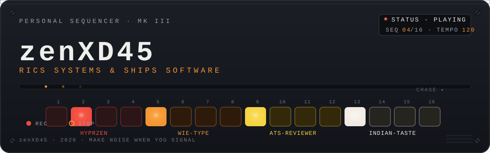

  

  <code>LINUX TINKERER</code> <code>FULL-STACK DEV</code> <code>HYPRLAND RICER</code>

  I hand-craft Hyprland dotfiles, then build apps people actually click. I use Arch btw.

 

<code>● BANK A · WHOAMI</code>

Mostly found inside a terminal, configuring things that were already working. When I am not ricing, I build web apps — Next.js, React, Python — and ship the ones worth keeping.

 

<table>
<tr>
<td><b>CHASSIS</b></td>
<td><code>zen@github</code></td>
<td><b>DISCIPLINE</b></td>
<td><code>rics systems, ships software</code></td>
</tr>
<tr>
<td><b>OS</b></td>
<td><code>Arch Linux (btw)</code></td>
<td><b>SHELL</b></td>
<td><code>Bash / Zsh</code></td>
</tr>
<tr>
<td><b>WM</b></td>
<td><code>Hyprland · Wayland</code></td>
<td><b>EDITOR</b></td>
<td><code>Neovim</code></td>
</tr>
<tr>
<td><b>TERMINAL</b></td>
<td><code>Kitty</code></td>
<td><b>OUTPUT</b></td>
<td><code>TypeScript · Python · Lua · Bash · QML</code></td>
</tr>
</table>

 

<code>● BANK B · SEQUENCE — FOUR STEPS ARMED</code>

▪ <b>01 · HyprZen</b> <code>Lua</code> — Hyprland dotfiles &amp; dynamic theme engine

Hand-crafted dotfiles plus a theme engine for Hyprland: hot-swappable themes, automated wallpaper scraping and sorting, and live theme sync across Waybar, Kitty, SwayOSD, Rofi, and Neovim — no restarts needed.

<a href="https://github.com/zenXD45/HyprZen">open repo →</a>

▪ <b>02 · WieType-PRO</b> <code>Next.js</code> — AI-assisted typing &amp; writing practice

A typing and writing platform powered by Google Gemini: AI-generated practice prompts, live WPM and accuracy feedback, performance graphs, five color themes, and keyboard-first restarts.

<a href="https://github.com/zenXD45/WieType-PRO">open repo →</a>

▪ <b>03 · ats-reviewer</b> <code>Python</code> — an honest ATS resume reviewer &amp; builder

An honest ATS resume reviewer and builder from the ground up — it checks resumes and builds ones that score 95+ on its own engine.

<a href="https://github.com/zenXD45/ats-reviewer">open repo →</a>

▪ <b>04 · indian-taste</b> <code>Next.js</code> — marketing site for a family restaurant &amp; homestay

A marketing site for a family-run restaurant and homestay, minutes from Jolly Grant Airport in Uttarakhand — built as a pitch piece with Next.js 16, React 19, and Tailwind v4.

<a href="https://github.com/zenXD45/indian-taste">open repo →</a>

 

<b>MORE STEPS · NEXT BATCH</b>

<table>
<tr>
<td>▪ <a href="https://github.com/zenXD45/Zen-Shell"><b>Zen-Shell</b></a> <code>QML</code></td>
<td>A glassmorphic Hyprland shell — Dynamic Island, Dock, Spotlight search, desktop widgets</td>
</tr>
<tr>
<td>▪ <a href="https://github.com/zenXD45/mangaverse"><b>mangaverse</b></a> <code>TypeScript</code></td>
<td>A free online platform to read manga · <a href="https://mangaverse-tawny.vercel.app">live →</a></td>
</tr>
<tr>
<td>▪ <a href="https://github.com/zenXD45/Chat-Spark"><b>Chat-Spark</b></a> <code>TypeScript</code></td>
<td>An LLM-powered chat app built with Next.js</td>
</tr>
<tr>
<td>▪ <a href="https://github.com/zenXD45/HFP"><b>HFP</b></a> <code>JavaScript</code></td>
<td>Full-stack ML app that predicts heart-failure risk from patient vitals · <a href="https://hfp-ten.vercel.app">live →</a></td>
</tr>
<tr>
<td>▪ <a href="https://github.com/zenXD45/music_bot"><b>music_bot</b></a> <code>Python</code></td>
<td>A music bot written in Python</td>
</tr>
<tr>
<td>▪ <a href="https://github.com/zenXD45/walker-gif-picker"><b>walker-gif-picker</b></a> <code>Python</code></td>
<td>A native GIF picker for the Walker launcher — Hyprland &amp; Sway ready</td>
</tr>
</table>

 

<code>● BANK C · TOOLKIT</code>

<code>SYSTEMS &amp; CRAFT</code>
 

<code>ENGINEERING &amp; WEB</code>
 

 

<code>● BANK D · PATCH OUT</code>

<table>
<tr>
<td>▪ GitHub</td>
<td><a href="https://github.com/zenXD45">github.com/zenXD45</a></td>
</tr>
<tr>
<td>▪ Mangaverse</td>
<td><a href="https://mangaverse-tawny.vercel.app">mangaverse-tawny.vercel.app</a></td>
</tr>
<tr>
<td>▪ HFP</td>
<td><a href="https://hfp-ten.vercel.app">hfp-ten.vercel.app</a></td>
</tr>
</table>

  
  

  

  <code>SEQUENCE COMPLETE · 04 / 16 STEPS ARMED · THANKS FOR LISTENING</code>

